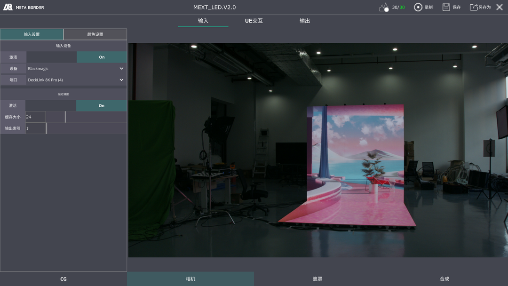
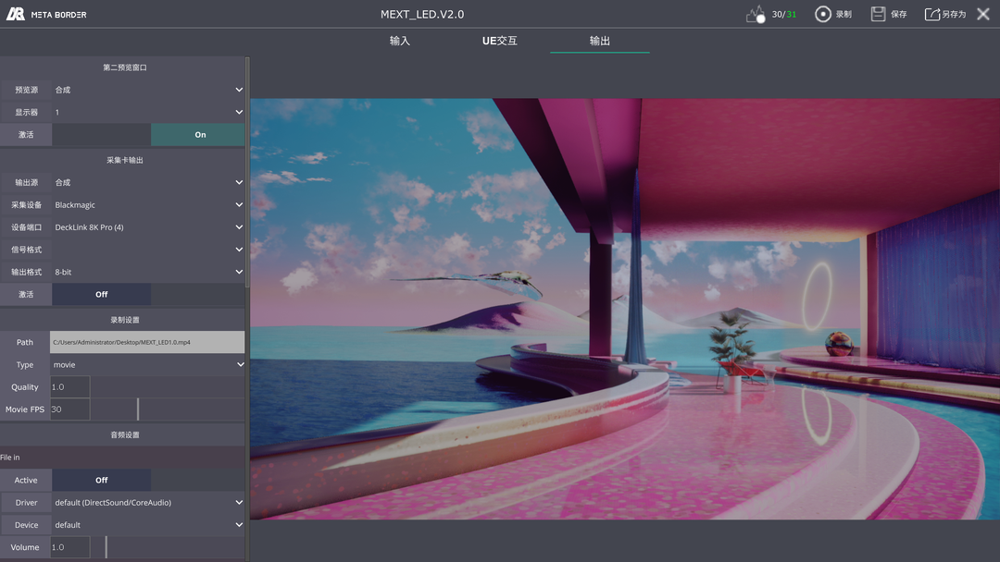

# FreedTool Freed转发神器

功能
1. 接收并转发Freed数据到指定IP和端口
2. 修改cam ID(同时使用2个Redspy时，默认cam id都是255，修改以更好区分)
3. IP尾段设为255可以段内广播，全段设为255可以全段广播
4. 数据帧率自适应

A tool that 
1. Recieves and forward Freed data to the IP and ports you want.
2. Change the cam ID(when it comes to 2 Redspys in one project, you may need it).
3. The last digit of IP can be set to 255 to broadcast in the same network.
4. The whole IP can be set to 255 to broadcast in the whole network.
5. The frame rate of the data is adaptive.

更新计划

1. 增加数据滤波
2. 增加offset\归零功能
3. 增加倍帧功能

update plan
1. Add data filtering
2. Add offset\zeroing function
3. Add frame doubling function

MEXT是我司自研的XR实时合成系统

MEXT is a XR real-time compositing system

更多资料可以查看连接
for more information, please visit
https://mp.weixin.qq.com/s/k6Z0hWIr6k583JvWWhuC5g